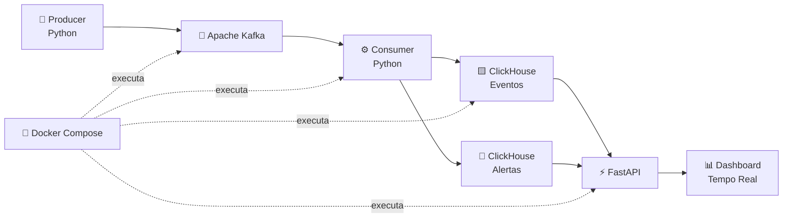

<div align="center">

# ⚡ REAL-TIME DATA PLATFORM

### 📡 Dados de veículos em tempo real com Python • Kafka • ClickHouse • FastAPI • Docker


<br/>


<br/>


</div>

---

## 🛰️ Visão geral

Este projeto simula uma plataforma de monitoramento de veículos capaz de gerar, transmitir, processar, armazenar e disponibilizar dados de telemetria continuamente.

O objetivo foi construir um fluxo completo de **Engenharia de Dados em tempo real**, utilizando Apache Kafka para streaming, ClickHouse para armazenamento analítico, FastAPI para disponibilização dos dados e Docker para execução dos serviços.

```text
╭──────────────────────────────────────────────────────────────────────╮
│                    REAL-TIME DATA PLATFORM                           │
├──────────────────────────────────────────────────────────────────────┤
│                                                                      │
│   🚗 PRODUCER                                                        │
│       │                                                              │
│       ▼                                                              │
│   📡 APACHE KAFKA                                                    │
│       │                                                              │
│       ▼                                                              │
│   ⚙️ CONSUMER                                                        │
│       │                                                              │
│       ├──────────────► 🚨 DETECÇÃO DE ALERTAS                        │
│       │                                                              │
│       ▼                                                              │
│   🟨 CLICKHOUSE                                                      │
│       │                                                              │
│       ▼                                                              │
│   ⚡ FASTAPI                                                         │
│       │                                                              │
│       ▼                                                              │
│   📊 DASHBOARD EM TEMPO REAL                                         │
│                                                                      │
╰──────────────────────────────────────────────────────────────────────╯
```

---

# 🧠 Arquitetura



---

# 📡 Fluxo dos dados

O pipeline funciona continuamente:

```text
01 • 🚗 Geração de telemetria
        ↓
02 • 📡 Envio do evento para o Kafka
        ↓
03 • ⚙️ Consumo da mensagem
        ↓
04 • 🔎 Análise do evento
        ↓
05 • 🚨 Detecção de possíveis alertas
        ↓
06 • 🟨 Persistência no ClickHouse
        ↓
07 • ⚡ Disponibilização pela API
        ↓
08 • 📊 Atualização do dashboard
```

Cada novo evento percorre toda a arquitetura automaticamente.

---

# 🚗 Dados de telemetria

O Producer simula dados enviados por diferentes veículos.

Cada evento possui:

```json
{
    "veiculo_id": "VEICULO-04",
    "velocidade": 87.45,
    "temperatura_motor": 94.32,
    "nivel_combustivel": 42.18,
    "data_hora": "2026-10-05T19:20:10"
}
```

Os veículos são gerados entre:

```text
VEICULO-01
...
VEICULO-10
```

Novos eventos são enviados continuamente para o Kafka.

---

# 📡 Apache Kafka

O Kafka funciona como a camada de streaming da plataforma.

Topic utilizado:

```text
telemetria-veiculos
```

Fluxo:

```text
Producer
   │
   ▼
telemetria-veiculos
   │
   ▼
Consumer
```

Dentro da rede Docker, os serviços se comunicam utilizando o próprio nome dos containers.

---

# ⚙️ Consumer

O Consumer recebe os eventos publicados no Kafka e processa cada mensagem.

Além de persistir a telemetria no ClickHouse, ele também verifica situações consideradas críticas.

### 🚨 Regras de alerta

```text
Velocidade > 80 km/h
→ velocidade_alta

Temperatura do motor > 100 °C
→ temperatura_alta

Combustível < 15%
→ combustivel_baixo
```

Um mesmo evento pode gerar alertas durante o processamento.

---

# 🟨 ClickHouse

O ClickHouse é utilizado para armazenar os dados processados.

Banco:

```text
telemetria
```

### 📊 Eventos

```text
eventos_telemetria
```

Campos:

```text
veiculo_id
velocidade
temperatura_motor
nivel_combustivel
data_hora
```

### 🚨 Alertas

```text
alertas_telemetria
```

Campos:

```text
veiculo_id
tipo_alerta
valor
data_hora
```

O ClickHouse foi escolhido para representar uma camada de armazenamento voltada para consultas analíticas de dados.

---

# ⚡ FastAPI

A API disponibiliza os dados armazenados no ClickHouse para aplicações externas.

URL local:

```text
http://127.0.0.1:8001
```

### Endpoints

```text
GET /
GET /eventos
GET /alertas
GET /resumo
```

### 🔎 Últimos eventos

```powershell
Invoke-RestMethod http://127.0.0.1:8001/eventos
```

### 🚨 Últimos alertas

```powershell
Invoke-RestMethod http://127.0.0.1:8001/alertas
```

### 📊 Resumo da plataforma

```powershell
Invoke-RestMethod http://127.0.0.1:8001/resumo
```

O endpoint `/resumo` retorna indicadores como:

```text
Total de eventos
Veículos monitorados
Velocidade média
Maior velocidade
Temperatura média
Total de alertas
```

Documentação automática:

```text
http://127.0.0.1:8001/docs
```

---

# 📊 Dashboard em tempo real

O projeto possui um dashboard web que consulta a API automaticamente.

Ele apresenta:

```text
📡 Total de eventos

🚨 Total de alertas

🚗 Veículos monitorados

⚡ Velocidade média

🏎️ Maior velocidade

🌡️ Temperatura média

📈 Gráfico dos últimos eventos

📋 Últimos eventos recebidos

🚨 Alertas recentes
```

Os dados são atualizados automaticamente enquanto o pipeline está em execução.

### ▶ Executar o dashboard

```powershell
python -m http.server 5500 --directory dashboard
```

Depois acesse:

```text
http://127.0.0.1:5500
```

---

# 🐳 Docker

Os principais componentes da plataforma são executados utilizando Docker Compose.

Serviços:

```text
📡 kafka
🟨 clickhouse
🚗 producer_telemetria
⚙️ consumer_telemetria
⚡ api_telemetria
```

### 🚀 Iniciar a plataforma

```powershell
docker compose up -d
```

### 🔎 Verificar containers

```powershell
docker ps
```

### 📜 Visualizar Producer

```powershell
docker logs -f producer_telemetria
```

### 📜 Visualizar Consumer

```powershell
docker logs -f consumer_telemetria
```

### 🧯 Encerrar

```powershell
docker compose down
```

---

# 🔄 Tempo real

Uma forma simples de verificar se o pipeline está realmente processando novos eventos:

```powershell
(Invoke-RestMethod http://127.0.0.1:8001/resumo).total_eventos

Start-Sleep -Seconds 6

(Invoke-RestMethod http://127.0.0.1:8001/resumo).total_eventos
```

Exemplo:

```text
1874

1877
```

Isso mostra que novos eventos estão percorrendo:

```text
Producer
   ↓
Kafka
   ↓
Consumer
   ↓
ClickHouse
   ↓
FastAPI
   ↓
Dashboard
```

---

# 🗂️ Estrutura do projeto

```text
real-time-data-platform/
│
├── 📡 api/
│   └── main.py
│
├── ⚙️ consumer/
│   └── consumer_eventos.py
│
├── 📊 dashboard/
│   └── index.html
│
├── 🚗 producer/
│   └── gerador_eventos.py
│
├── 🐳 Dockerfile
│
├── 🐳 docker-compose.yml
│
├── 📋 requirements.txt
│
├── 🔐 .env
│
├── 🛡️ .gitignore
│
└── 📖 README.md
```

> O arquivo `.env` é utilizado apenas localmente e não deve ser enviado ao GitHub.

---

# 🔐 Segurança

Arquivos locais e informações sensíveis não devem ser versionados.

```gitignore
.venv/
__pycache__/
*.pyc

.env

.vscode/

.DS_Store
```

Dessa forma, credenciais e configurações locais permanecem fora do repositório público.

---

# 🚀 Quick Start

Clone o projeto:

```powershell
git clone https://github.com/iamgusta/real-time-data-platform.git
```

Entre na pasta:

```powershell
cd real-time-data-platform
```

Crie o ambiente virtual:

```powershell
python -m venv .venv
```

Ative:

```powershell
.\.venv\Scripts\Activate.ps1
```

Instale as dependências:

```powershell
pip install -r requirements.txt
```

Suba a infraestrutura:

```powershell
docker compose up -d --build
```

Inicie o dashboard:

```powershell
python -m http.server 5500 --directory dashboard
```

Acesse:

```text
Dashboard
http://127.0.0.1:5500

API
http://127.0.0.1:8001

Swagger
http://127.0.0.1:8001/docs
```

---

# 🧩 Tecnologias utilizadas

```text
🐍 Python
📡 Apache Kafka
🟨 ClickHouse
⚡ FastAPI
🐳 Docker
🌐 HTML
🎨 CSS
⚙️ JavaScript
📈 Chart.js
```

---

# 🎯 Objetivo do projeto

Este projeto foi desenvolvido para praticar conceitos utilizados em Engenharia de Dados, principalmente:

```text
Streaming de dados
Processamento de eventos
Arquitetura orientada a eventos
Producer e Consumer
Mensageria com Kafka
Persistência analítica
APIs
Containers
Monitoramento em tempo real
```

Mais do que gerar dados, a proposta foi entender como diferentes componentes podem trabalhar juntos dentro de uma arquitetura de dados contínua.

---

# 🛰️ System Status

```text
╔══════════════════════════════════════════════════════════╗
║                REAL-TIME DATA PLATFORM                  ║
╠══════════════════════════════════════════════════════════╣
║ 🚗 PRODUCER          ████████████████████  RUNNING      ║
║ 📡 KAFKA             ████████████████████  ONLINE       ║
║ ⚙️ CONSUMER          ████████████████████  RUNNING      ║
║ 🟨 CLICKHOUSE        ████████████████████  CONNECTED    ║
║ ⚡ FASTAPI           ████████████████████  ONLINE       ║
║ 📊 DASHBOARD         ████████████████████  LIVE         ║
╠══════════════════════════════════════════════════════════╣
║              📡 DATA STREAM ACTIVE                      ║
╚══════════════════════════════════════════════════════════╝
```

---

<div align="center">

### ⚡ EVENT → STREAM → PROCESS → STORE → API → DASHBOARD

```text
🚗
│
▼
📡 KAFKA
│
▼
⚙️ PROCESS
│
▼
🟨 STORE
│
▼
⚡ API
│
▼
📊 MONITOR
```

### 📡 Construindo pipelines que transformam eventos em dados em tempo real.

<br/>

**Desenvolvido por [Gustavo Lopes](https://github.com/iamgusta)**

</div>
